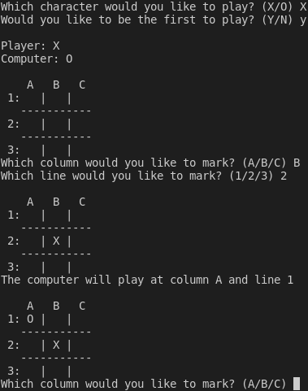

# Tic Tac Toe

## Overview 

Tic Tac Toe game solved automaticaly. It posseses the following characteristics:

- Developed with C99;
- The [Tic Tac Toe](https://en.wikipedia.org/wiki/Tic-tac-toe) is played on a three-by-three grid by two players, who alternately place the marks X and O in one of the nine spaces in the grid;
- It uses the [Minimax](https://pt.wikipedia.org/wiki/Minimax) algotithm in order to determine the best moves for the computer player;
- It operates directely in the terminal producing an output just like this:



## Usage

Download this project and compile it by typing the command `make` in its folder. Next, just run the executable:

```
./tictactoe
```

The remaining instructions will be assed by the executable itself.
